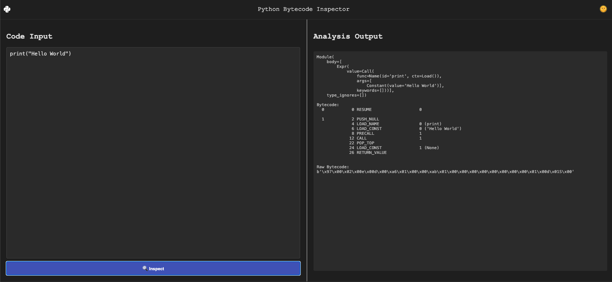

# Python Bytecode Inspector

A simple web-based tool built using **React** and **Pyodide** that allows users to input Python code, view its **Abstract Syntax Tree (AST)**, **bytecode**, and **raw bytecode**. This tool helps you understand how Python code is parsed, compiled, and executed at a low level.

## Features

- **AST Viewer**: View the Abstract Syntax Tree (AST) representation of your Python code.
- **Bytecode Disassembler**: See the disassembled bytecode of your Python code.
- **Raw Bytecode**: View the raw bytecode as generated by Python’s compiler.

## Demo

Check out the live demo of the tool [here](https://anistark.github.io/python-bytecode-inspector).



## Installation

### Prerequisites

- Node.js and npm installed on your local machine.

### Steps to Run Locally

1. Clone this repository:
   ```bash
   git clone https://github.com/yourusername/python-bytecode-inspector.git
   ```

2. Navigate to the project directory:
   ```bash
   cd python-bytecode-inspector
   ```

3. Install the dependencies:
   ```bash
   npm install
   ```

4. Start the development server:
   ```bash
   npm start
   ```

5. Open your browser and go to [http://localhost:3000](http://localhost:3000) to view the app.

## Contributing

Feel free to fork this repository and submit pull requests to improve the tool. Any contributions to enhance the functionality, UI/UX, or performance are welcome!

### Steps to Contribute:
1. Fork the repository.
2. Create a new branch (`git checkout -b feature-name`).
3. Make your changes and commit them (`git commit -am 'Add new feature'`).
4. Push the branch (`git push origin feature-name`).
5. Create a pull request.

## License

This project is licensed under the MIT License - see the [LICENSE](LICENSE) file for details.
